# COMP2150  - Level Design Document
### Name: [Mingyou Han]
### Student number: [46991808] 

## 1. Player Experience

### 1.1. Discovery

Discovery is a type of soft fun where the reward is insight and knowledge gained. Therefore, in this game, the fun of discovery is aimed firstly at uncovering more of the game's mechanics such as jump-melee-dash. Learning more about hidden dynamics within the game rewards players as players gain insight. Breakables are placed to help facilitate the learning process of the melee dash. 

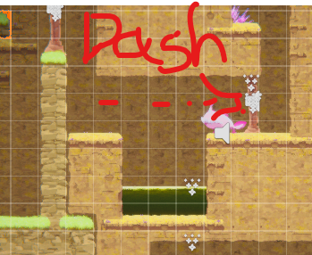

These serves are a call back to the initial start of the level where players may recall (or through a second playthrough)  that they can “cheat” the game by melee-dashing right after spawn to unlock “path 2”. Which the level is designed to be completed quicker as all 3 keys are piled at the top section.

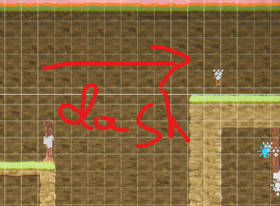

Another game dynamic that facilitates discovery uses the same formula as the previous one. The damage knockback is used to create a mini-puzzle which the player can complete after. (Elaborate further in the exploration section)

Furthermore, the room switch mechanic that is triggered by switches adds to the element of discovery and subversion, hinting at more secrets to unlock which potentially creates reward incentives for exploration.

**Pre-toggle** the switch that quickly switches back and forth the scene

**Post** What the "switch" do
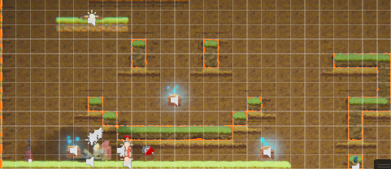

This switch toggles the room to foreshadow the switch in conjunction with a unique background. This is to draw attention to the feature and remind the player that the room is the same. Creating subversion and hinting at other potential secrets hiding in plain sight, encouraging exploration through discovery.

### 1.2. Drama

Firstly, relief was created by the design of the centre room which provides both the function of an overlook point to the entire level and a break room to create "safety". This box uses positive space in the centre of the map to create a safe environment as the space in itself is emphasised.

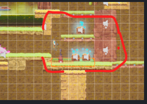

This relief is placed right after a “power moment” that the player experiences after picking up the gun and killing a tunnel packed with chompers and spitters. 

This power moment is enhanced by the fact that players are designed to die to chompers before this encounter. Offering a chance of vengeance, taking inspiration from Sakiro, where the player dying is a narrative element that enhances the overall experience and adds subversion to the narrative as a fun experience.

Other drama elements are added such as adding randomness to the switches to create uncertainty for fun.

This switch unlike all the other previous switches spawns in an encounter to spice up the area and create drama.  

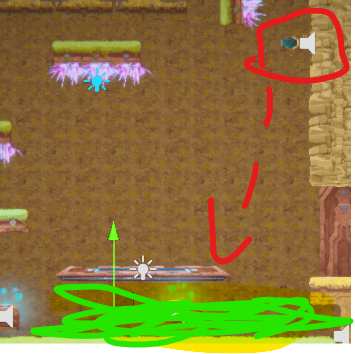

which is similar to this switch that creates an acid pool as players progress through the level 3 platform Obby in order to increase tension and challenge.

### 1.3. Challenge

A Challenge is a type of hard fun which is driven by frustration, obstacles and practice. I have designed this level to require jumping shots alongside interference from moving platforms that block the bullets.

This final level was set up and introduced after the player was given similar practice shots of the jump and shooting mechanic, ramping up the difficulty curve to keep the player in a flow state.

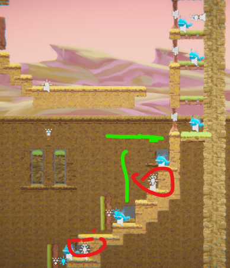

Circled in red is the target which the player needs to shoot alongside the spitters, this also introduces bullet interaction to the switch as the player may accidentally shoot the switch in the process. And in green are the platforms spawning as the switches are hit, foreshadowing the mechanics of the following level.
The main challenge is also controlling the jumping as players already learnt the basic movements. The one-block jump on horizontal moving platforms requires an intuitive understanding of jump distance and patience to pass the final Room.

This image illustrates the jumping shot that needs to be made on the first moving platform, then the player needs to jump from the second platform to the one-block width platform that is moving vertically.

### 1.4. Exploration

To reward and encourage exploration I have considered using extrinsic rewards like unlocking the gun and health pickups, although limited, and intrinsic rewards through discovery and aesthetic choices.  
The beautiful background vistas itself can act as a form of reward to exploration. The weathered look to the background and the cave outlook at the initial spawn point was made to create a sense of environment, playing to a limited idea of cave diving.

In conjunction with discovery, optional paths and small puzzles such as the knockback jump were added to reward players with the gun unlocked earlier.

Furthermore, a specific “hidden” room was created to reward more curious players who learnt and recalled that breakable blocks were placed right next to the centre room. A Metroidvania-like design, where new abilities, in this case, insight, were learnt and traversal back to an area before progressing further in the game.

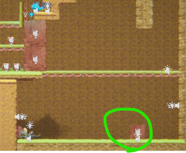
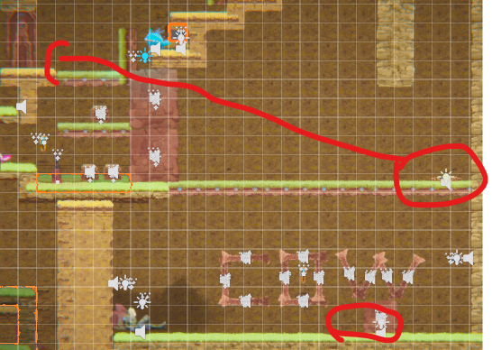

This rewards a quick unlock to the shortcut and a hidden “cow level” with an extra key as a homage to the Diablo games. 
Also, the circle layout and two potential paths was introduced in the hope of breaking linearity by adding more exportation opportunities.

## 2. Core Gameplay (~400 words)

### 2.1. Weapon Pickup (Staff)

Staff was given to the player in the initial spawn to introduce the dash jump and breakable obstacles. This also allows for the alternative path opinion if the player already understood the dash jump.

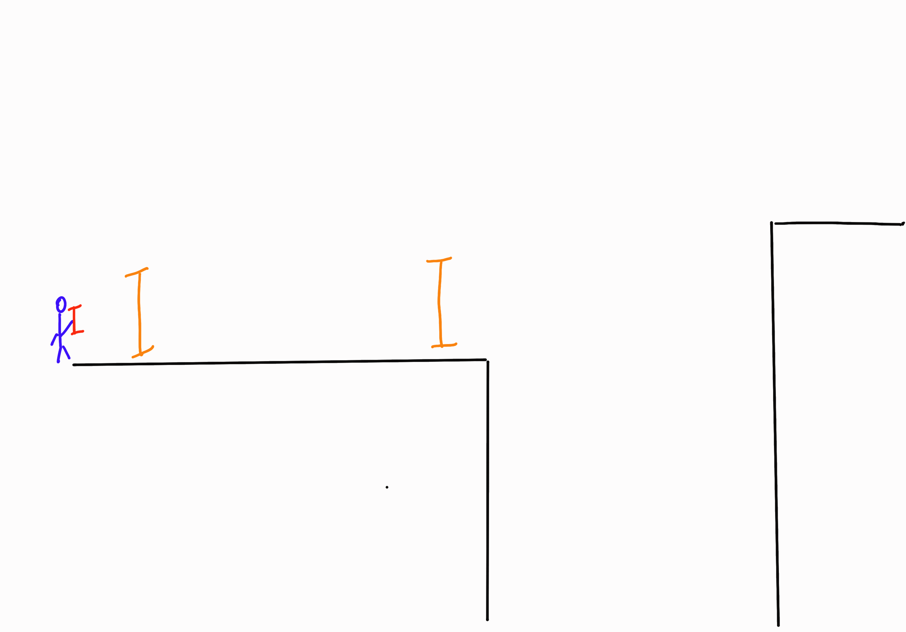
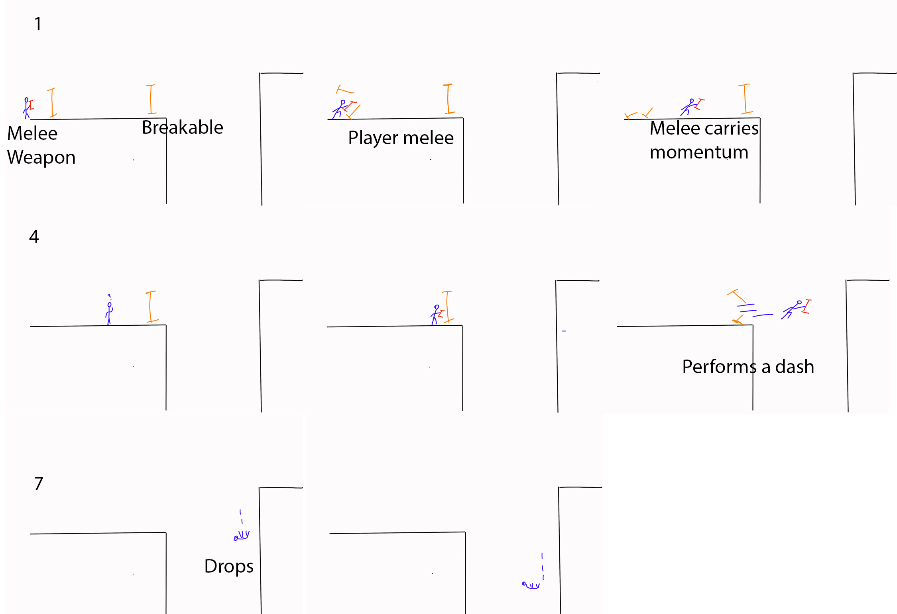

The fall is important to show the player's dash carries momentum while airborne. 
Breakable obstacles are placed to force the player to perform the required mechanic to achieve the above goal.

### 2.2. Spitter, Passthrough Platforms, spikes and Health Pickup

Spitter and enemy are introduced as the player is falling, spitting projectile while remaining safe.

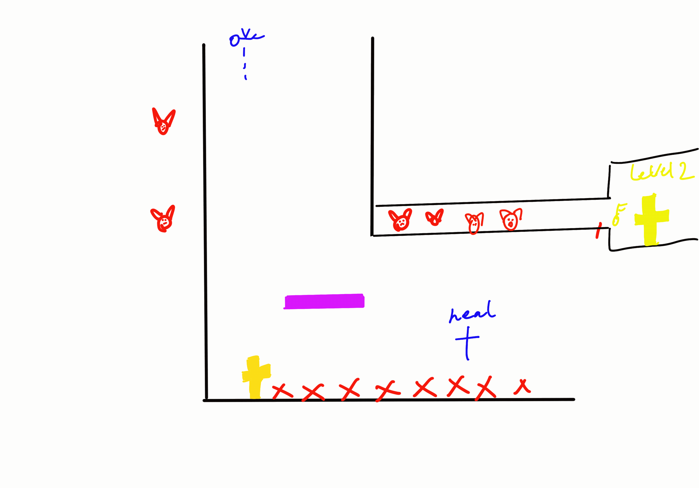
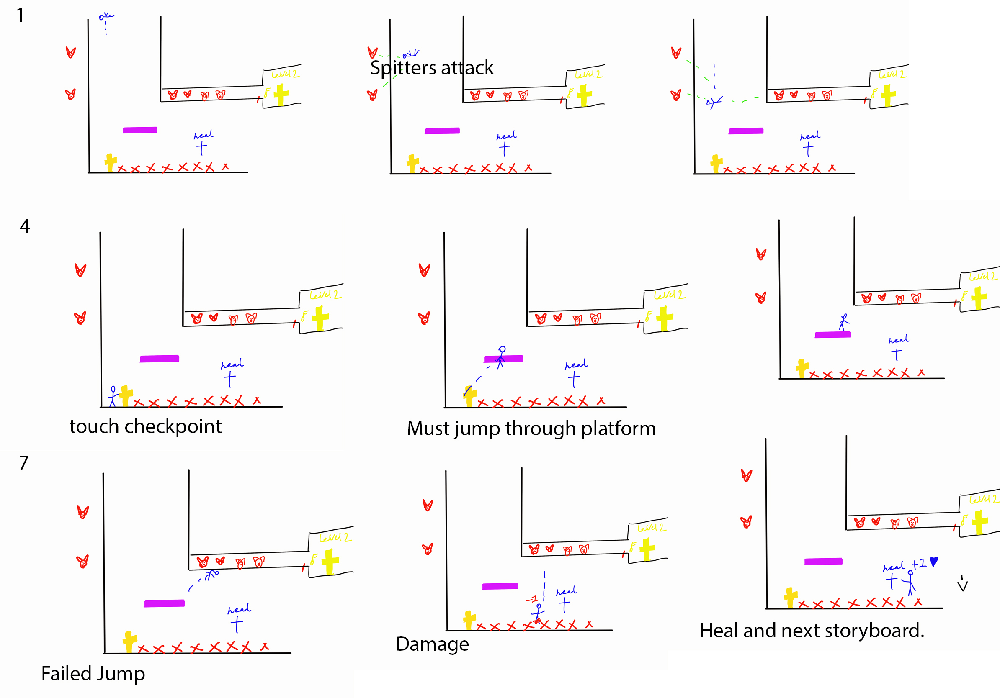

The passthrough platform is placed to force the player to take damage so that the player can collect the healing afterwards.

This also gives a chance to demonstrate damage knockback and invincibility frames.

Checkpoint will be introduced later.

### 2.3. Acid and Chomper

Chomper dash attacks the player but falls in acid and dies. A safe way for the player to know the hostile environment, inspired by Half-life the barnacle eating the bird.

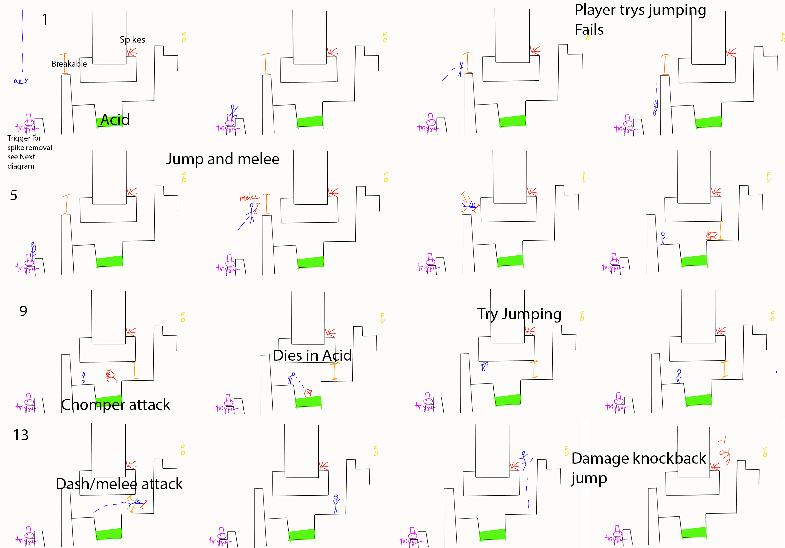
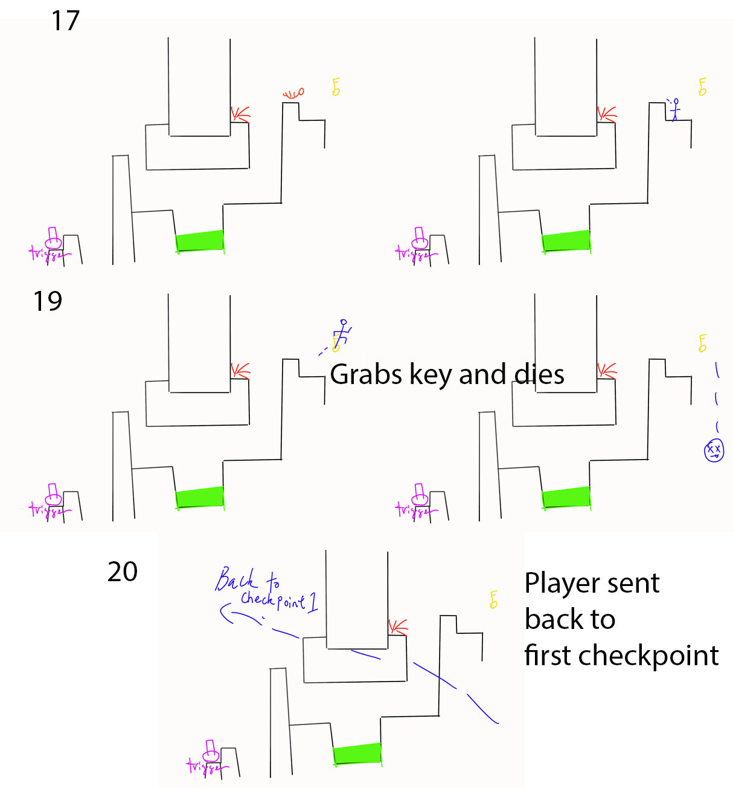

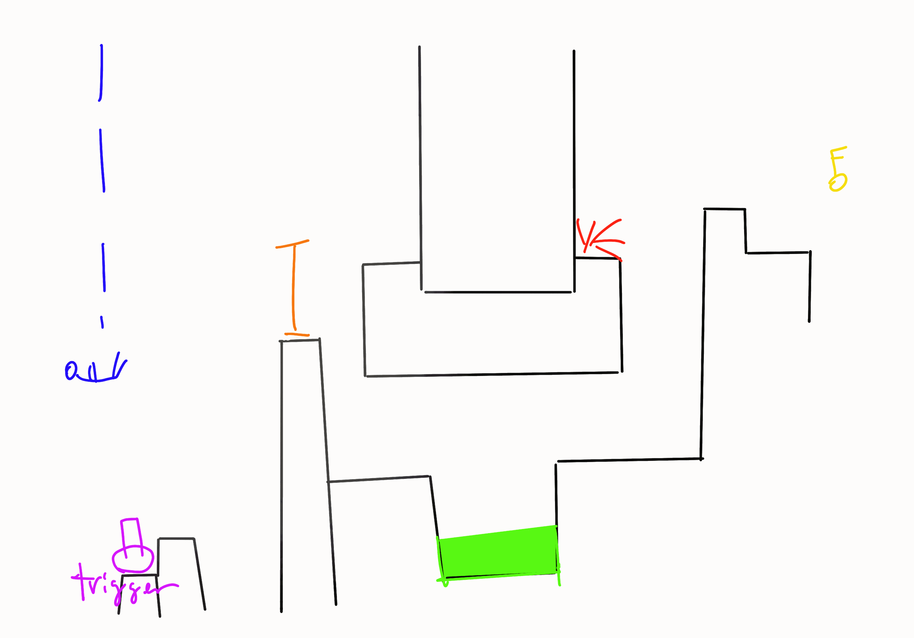

the breakable obstacles are placed to hint to the player that a dash attack is needed to solve the jumping puzzle, as the player learnt to melee the obstacles.

Afterwards, the damage from the spike acts as a boost to the player. Allowing the key to be grabbed.

The player then falls to death, to return to the previous checkpoint.

sidenote: the trigger is placed on the landing zone to trigger the spike removal seen in the next section.

### 2.4. Moving Platforms and checkpoints (also gun pickup)

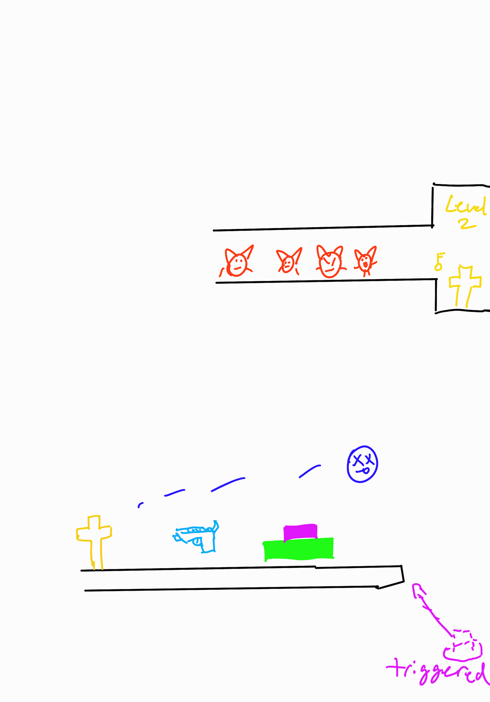

As the player teleports back to the checkpoint the spikes are removed and replaced by the moving platform acting as an elevator with a button to stop it from moving. The button was included to enhance the “power moment” for more control while the player is shooting and rapidly killing enemies.  

## 3. Spatiotemporal Design
 
### 3.1. Molecule Diagram

### 3.2. Level Map – Section 1

### 3.3.	Level Map – Section 2

#### Level Plan 
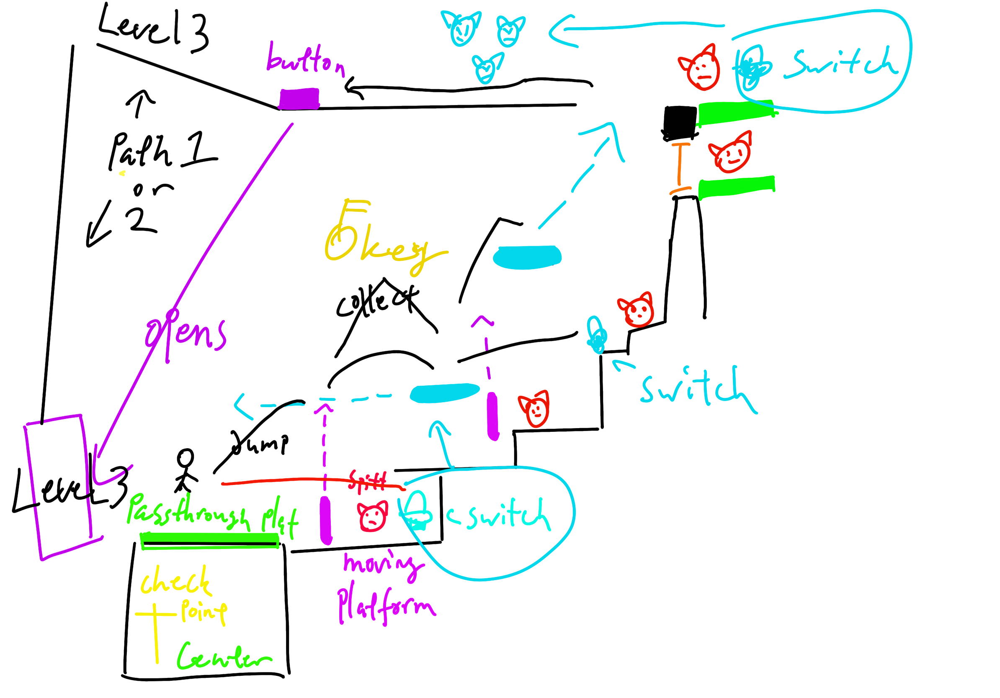

### 3.4.	Level Map – Section 3

#### Level Plan
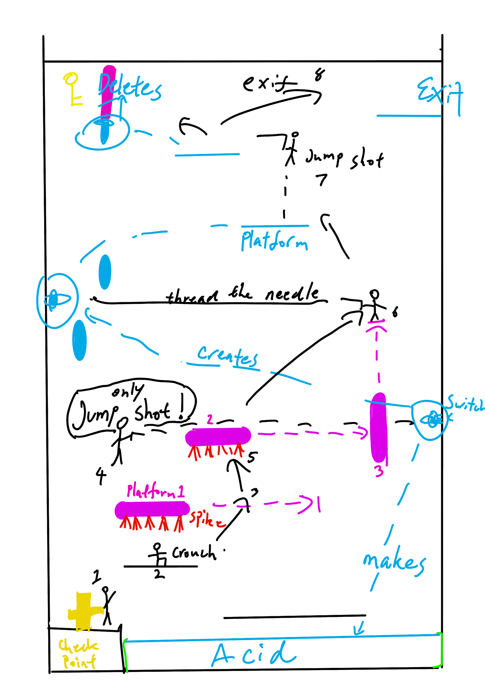

## Level Map Compiled

## 4. Iterative Design

  Throw away prototyping 

### scrapbook Map design

### E to H join room concept

### R stairway with moving platforms

 
E to H join room feasibility check

Refined design to better act as a puzzle.

Making the initial Map design work.

Early scrapebook idea for the knockback jump

